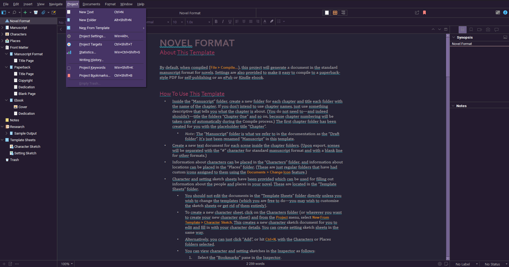

# SynthWave '84 - Scrivener theme

An attempt to port the awesome [SynthWave '84 - VS Code theme](https://github.com/robb0wen/synthwave-vscode 'SynthWave \'84 - VS Code theme') by [Robb Owen](https://github.com/robb0wen 'Robb Owen') to Scrivener 3.

## Used fonts

* [Roboto](https://fonts.google.com/specimen/Roboto 'Roboto')

## Install

Use `Window->Themes->Import Themes...` menu to import `dist/SynthWave84.scrtheme` file.
